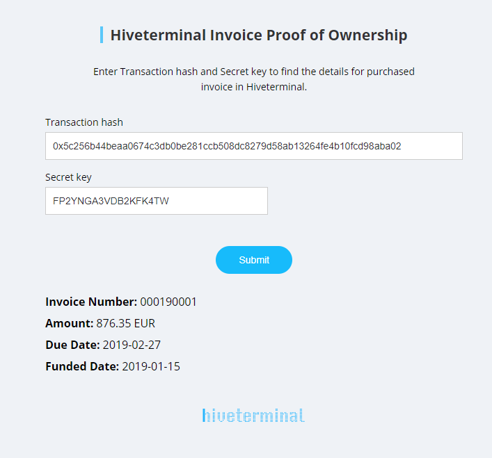

# Hiveterminal Invoice Proof of Ownership

Download and open the standalone .html file in browser. 

## Supported browsers

Latest versions of Chrome and Firefox. 

### Implementation

To use this tool, you have to have invoice buyer account  on Hiveterminal: https://hiveterminal.com.
Only invoice buyers who purchase invoices on the platform will be able to check the proof of invoice ownership with this web tool. 
When you buy an invoice on the platform, the system will give you access to the hash of the performed transaction on our instance of blockchain plus a secret key. The same hash is also stored on our smart contract in Ethereum network.
In the case when both inputs are valid, you will see details of the purchased invoice without any need to access hiveterminal platform.

Hiveterminal platform automatically pushes details to the public blockchain, for the purchase transactions performed in the private blockchain. 
Sample results are visible in the screenshot below. 

#### Sample Results

  

###### Copyright © 2019 Hive Project Ltd.
